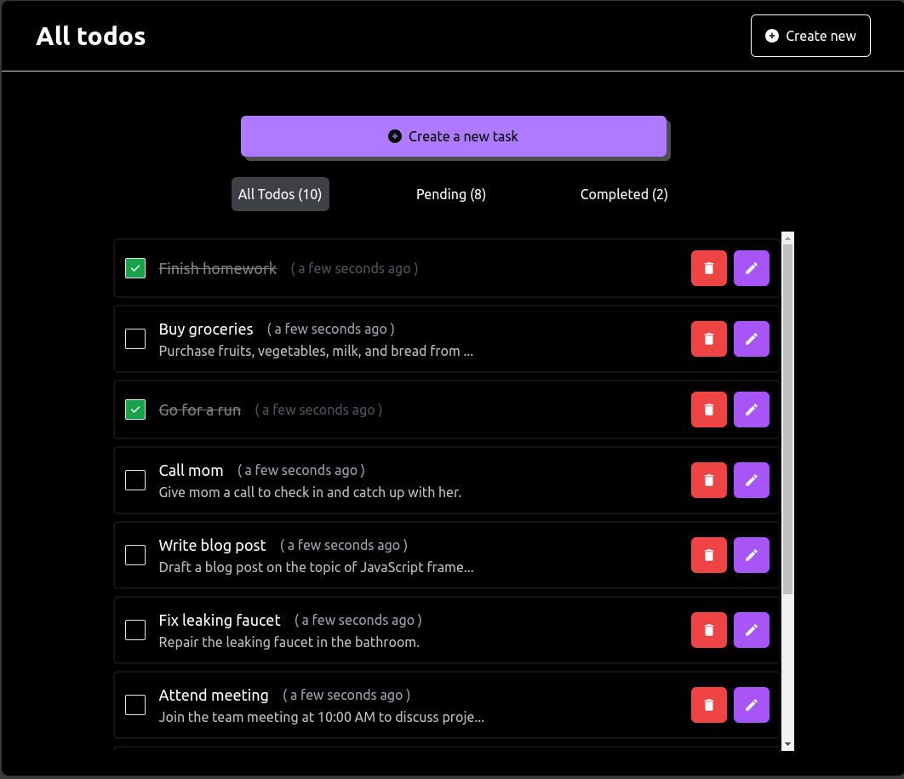
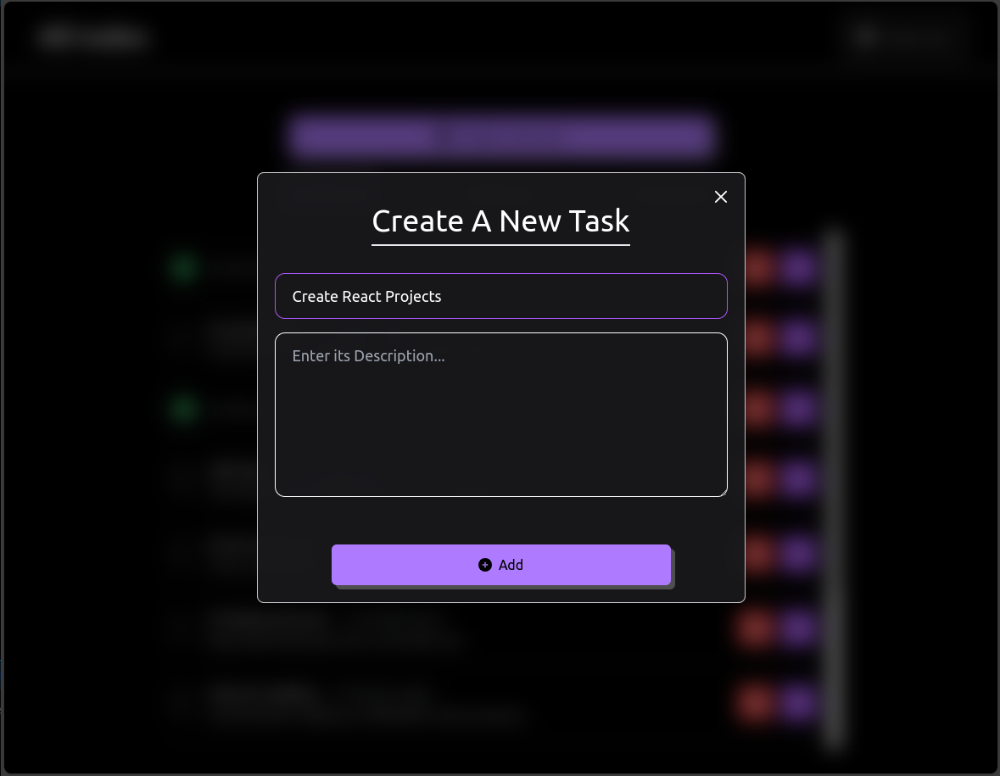
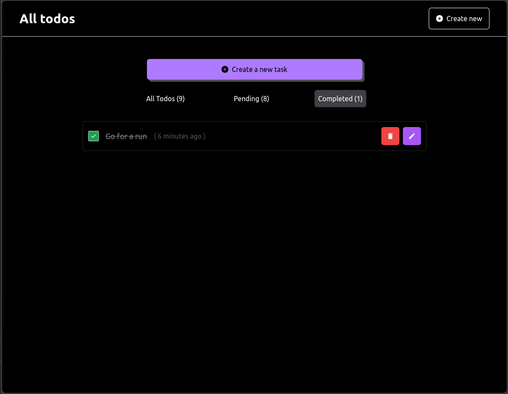

# Todo List Web App



## Overview

This is a Todo List web application built using React.js and TypeScript. It provides functionality for managing todos, including creating, updating, toggling status, and deleting todos. The app also supports filtering todos based on their status (all, pending, complete).

## Features

- **Create Todo:** Add new todos with a title and description.
- **Update Todo:** Edit the title and description of existing todos.
- **Toggle Todo Status:** Mark todos as complete or pending.
- **Delete Todo:** Remove todos from the list.
- **Filtering:** View all todos, pending todos, or complete todos.

## Technologies Used

- React.js
- TypeScript
- Context API
- Tailwind CSS

## Screenshots





## Getting Started

1. Clone the repository:

   ```bash
   git clone https://github.com/Rudra-Patel-code/todo-typescript

   ```

2. Install dependencies:

   ```bash
   cd todo-typescript
   npm install

   ```

3. Start the server:

   ```bash
   npm run dev
   ```
